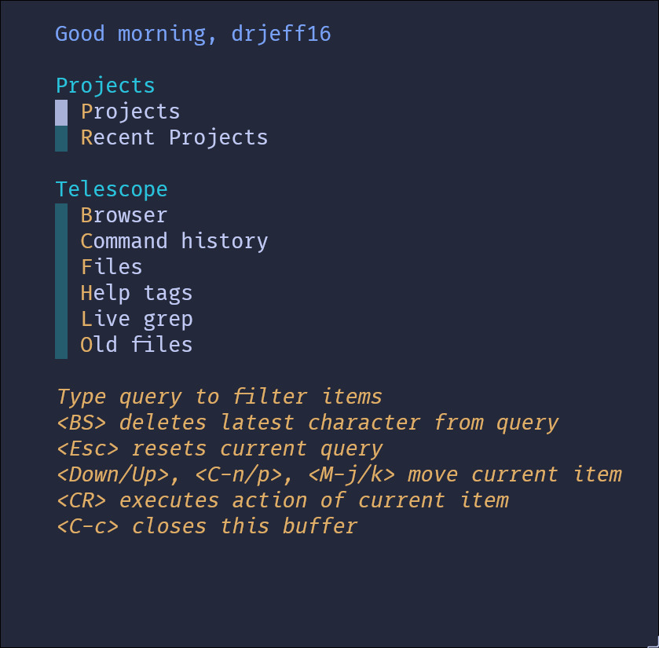

> [!IMPORTANT]
> **This README is in desperate need of a whole rewrite!**

---

# Jnvim

[Codeberg Mirror](https://codeberg.org/DrKJeff16/nvim) (MAIN) | [GitHub Mirror](https://github.com/DrKJeff16/nvim)

A modular, obsessively documented, portable, platform-agnostic [Neovim](https://github.com/neovim/neovim) config.

---

## License

[MIT](./LICENSE)

<!-- vim: set ts=2 sts=2 sw=2 et ai si sta: -->
